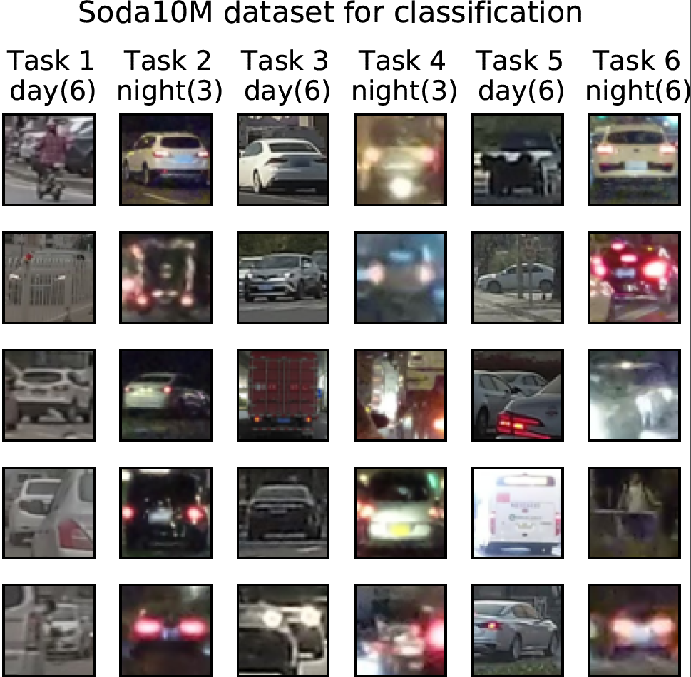

# TADIL: Task-Agnostic Domain-Incremental Learning through Task-ID Inference using Transformer Nearest-Centroid Embeddings

Classical Machine Learning (ML) models struggle with data that changes over time or across domains due to various factors such as noise, occlusion, illumination or frequency, unlike humans who can learn from such non independent and identically distributed data. Consequently, a Continual Learning (CL) approach is indispensable, particularly, Domain-Incremental Learning, as classical static ML approaches are inadequate to deal with data that comes from different distributions.

This project aims to develop a domain-incremental detector for continual learning. This required preparing the model (based on object classification) and the autonomous driving dataset, developing an unsupervised drift detector for autonomous driving scenarios with modular capabilities, and implementing an incremental drift detector and task classifier capable of distinguishing each type of emerging domain (e.g., weather, time of the day, location) and remembering the domains already encountered.

## TADIL
A novel pipeline for detecting and identifying tasks in domain-incremental learning scenarios without supervision is shown in Figure 1.

Figure 1: Given a batch of images as input $x$ associated with a specific task $T$, our method calculates the nearest-centroid embeddings $N_i$ and then checks whether they exhibit drift. If drift is present, we save $N_i$ in memory $\mathcal{M}$ and then a task classifier $h$ is incrementally trained using $N_i$ and $T_i$ with no supervision. Conversely, if no drift is detected, the classifier $h$ is employed to estimate the task $\hat T$. The multi-head classifier then selects the appropriate classifier based on the predicted task, generating the final prediction $y$.

## Features

- We propose an unsupervised method for training incrementally a task detector and a task classifier that can predict if a new task appears in inference time and the task label for a given input, respectively.
- We design an online pipeline algorithm that uses the semantic embeddings, density-based clustering, nearest-cluster centroids, and the task detector to decide when to learn a new task.

## Components
The incremental pipeline comprises four primary steps. First, we obtain a base embedding from the raw data using a transformer-based model. Second, we group the embedding densities based on their similarity to obtain the nearest points to each cluster centroid. Third, we train an incremental task classifier using only these points. Finally, we provide an algorithm that decides when to learn a new task using the task classifier.

- **Semantic embedding**: First, we use a pretrained transformer-based model to learn representations of common things such as pedestrians, cars, buildings, and other objects that are commonly found in driving scenarios. Also, it captures higher-level semantic information about the input that can be useful for various downstream tasks, such as classification, clustering, or retrieval.
- **Density-based clustering**: Next, we cluster the embeddings based on their similarity using a density clustering algorithm.
- **Nearest-cluster centroids**: We then obtain the nearest centroids of the clusters. Each centroid is calculated in the first phase of the Nearest Centroids Algorithm from the embeddings in each cluster.
- **Nearest-centroid Incremental classifier**: Finally, we obtain the task classifier for each task by running the second phase of the Nearest Centroids Algorithm.
  * Task classifier see: https://github.com/gusseppe/TADIL/tree/main/task_classifier
- **Drift detector**: Drift detector is used to decide when to update incrementally the task classifier as new tasks arrive, that is to say, the trigger which will allow for effective learning in a domain with a changing task distribution.
  * Drift detector see: https://github.com/gusseppe/TADIL/tree/main/drift_detector

## An online pipeline algorithm for task-agnostic domain-incremental learning
we present a pipeline algorithm for task-agnostic domain-incremental learning in an online fashion by using the components presented in the previous section.

For each batch of images arriving as input, our algorithm calculates the nearest-centroid embeddings $N_t$ and then checks whether they exhibit drift with the already known tasks stored in the memory, starting with the most recent. Drift is evaluated through the drift detector introduced before. If the batch drifts regarding all the tasks, that is, it is a new task, we save $N_t$ in memory $\mathcal{M}$, we train incrementally the task classifier $h_t$ using $N_t$ and the new task label $T_t$ with no supervision, and we add a new head corresponding with this new task to the multi-head classifier, which will be used for inference until there is a domain change. Conversely, if we identify in the memory some task that is not drifting from the incoming batch, the classifier $h_t$ is employed to estimate the task ID. As this is expected to be the same as the matching task in the memory, we can add an additional check that will help to identify accuracy issues with the drift detector and/or the task classifier. The task ID is then fed into the multi-head classifier to select the appropriate classifier, which will be used for inference until there is a domain change.

 * Details can be seen at: https://github.com/gusseppe/TADIL/tree/main/online_pipeline

## Dataset

 -  **SODA10M**, it contains 10M unlabeled images and 20k labeled images. We use the objects of the labeled images (20,000 1920×1080  color images of 6 different objects) to evaluate our experiments. We created a modified version of the dataset used in the CLAD-C challenge for online classification (see Figure 2, Figure 3). We split up the 6 tasks into training (80\%) and testing data (20\%) so that we obtain a domain incremental setup for classification. Besides, we tested with different metrics which are aligned to our experiments.

Figure 2: Soda10M for the CLAD-C benchmark. It consists of 6 distinct tasks, each featuring a specific number of classes. For example, Task 1 includes images belonging to 6 classes taken during the day. Similarly, Task 2 includes images belonging to at most 3 classes taken at night. The objective of the multi-head model is to accurately classify images for each individual task.

Figure 3: Each task has distribution shifts in both the label/categories (e.g, more pedestrians at daytime, more cars at night, etc.) and domain distributions (weather, location, period, city) as shown in the following diagram (for example, check the distribution shifts  between T1 and T2)

